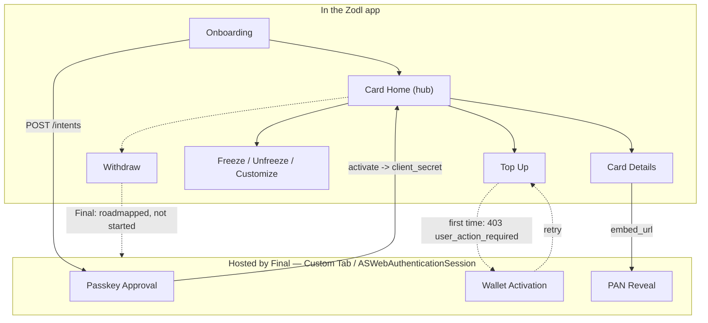

# Zodl Card via Final — Screen Specification

**PRO-380** · Living document · Last updated 2026-08-31

Screen-by-screen spec for the Zodl Card feature, mapping each screen in the current Figma to
the API call that feeds it and the screen it leads to. Built from Final's pre-release
"Integrating with Final" API doc (shared 2026-08-29), the Figma file, and PRO-380/382. Not a
design document — where a screen's data source isn't confirmed, it's marked and left
unresolved rather than guessed.

A visual version of this spec with real Figma screenshots next to the element lists exists
privately — ask in `#ext-final-zodl` if you need the link.

## Sources

- Linear: [PRO-380](https://linear.app/zodl/issue/PRO-380/zodl-card-via-final) ·
  [PRO-382](https://linear.app/zodl/issue/PRO-382/start-design-explorations-for-zodl-debit-card)
- Figma: [Zodl Card](https://www.figma.com/design/PM0vui65Tce6NiGvKM9dOn/Zodl-Card?node-id=409-40272)
- Slack: [`#ext-final-zodl`](https://zodl.slack.com/archives/C0BM4E0E137), specifically
  [Nathan's answers, 31.8](https://zodl.slack.com/archives/C0BM4E0E137/p1788180925626459?thread_ts=1788166958.307709&cid=C0BM4E0E137)
- Final's API doc: `integrating-with-final.html`, shared 2026-08-29, pre-release

## Legend

| Status | Meaning |
|---|---|
| ✅ **confirmed** | data source is stated explicitly in Final's API doc, no ambiguity |
| 🟠 **blocked** | depends on a question sent to Final, not yet answered |
| 🟣 **internal** | not a Final question at all — a Zodl-side product/design decision |
| 🔵 **future** | Final confirmed the capability doesn't exist yet; it's roadmapped, not something we're waiting on an answer for |

## Architecture — client-only, two tokens

No Zodl backend is involved anywhere in this feature. The app talks to `api.final.net`
directly, holding two credentials: a static **publishable key** baked into the app (identifies
Zodl, not secret), and a per-user **connection secret** obtained once through a PKCE + passkey
approval that happens in a Custom Tab / `ASWebAuthenticationSession` hosted on `final.net`,
then stored in Keystore/Keychain and sent as `Final-Connection` on every call after that.

## Mechanism — what stays in the app, what drops into Final's pages

Most of the feature is ordinary REST calls the app renders itself. Three moments hand off to a
page Final hosts and controls — connecting, the one-time wallet activation, and revealing the
raw card number. Withdraw is drawn with nowhere to land: Final confirmed (31.8) it's real but
not yet designed on their side.

Card Home is the hub every other screen returns to. Two spokes drop into Final-hosted pages
(connect, wallet activation, PAN reveal); Freeze/Unfreeze/Customize never leave the app;
Withdraw's line stops short — there's no page or route on the other side yet.

---

## Group A — Onboarding & setup

Runs once, before a persistent card exists. Ends with the first deposit.

| Screen | Shows | Data source | Nav | Status |
|---|---|---|---|---|
| **Home → Zodl** `#478:5993` `#714:8022` | App home before Card is set up — just an entry point | None (static) | → Card Onboarding carousel | ✅ |
| **Zodl + Card** `#478:6275` `#714:8182` | App home once Card exists — adds the persistent Card entry point | `GET /connections/{id}` | ↔ Card Home | ✅ |
| **Card Onboarding — Meet Zodl Card** `#753:17666` `#484:10448` `#769:2016` | Value-prop carousel; card-style preview art only (Black/Flame), not a real issued card yet | None | Home → this → Spend Anywhere | ✅ |
| **Spend Anywhere** `#478:6677` | Value-prop: usable anywhere the network is accepted | None — `Card.network = "visa"` confirmed; cross-border usability + Apple/Google Pay provisioning still unconfirmed with Final | carousel step | 🟣 |
| **Swap Back Anytime** `#478:6799` | Value-prop promising funds can move back to ZEC on demand | Implies a Balance→self-custody route. Final confirmed (31.8) this doesn't exist yet and isn't in active development. Showing this screen in V1 onboarding promises a capability the app can't deliver — flag to Andrea/Daniel before it ships | carousel step | 🔵 |
| **Zodl Single Account (No Keystone)** `#490:10827` | Gate shown to Keystone-signed accounts instead of Connect | Local account-type check. Not a Final constraint — nothing in the API requires excluding Keystone. Verify the reason with Andrea/Pablo | replaces Connect for Keystone accounts | 🟣 |
| **Card Onboarding — Fund it with ZEC** `#483:3730` | First-deposit prompt, shown right after Connect completes | None itself — hands off into Top Up | Connect (external) → this → Top Up → Default | ✅ |

## Group B — Card Home & spend

The persistent hub. Ten Figma frames named "Spend — Card Home (Default)" are one screen
re-skinned across up to eight cosmetic card styles — not ten states.

| Screen | Shows | Data source | Nav | Status |
|---|---|---|---|---|
| **Spend — Card Home (Default)** *(10 frames, one skin each)* | Balance, card status, recent activity | `GET /balances`, `GET /cards`, `GET /exchange_rate`; live via SSE `GET /connections/{id}/events` (poll fallback when Tor is on) | the hub — every flow below returns here | ✅ |
| **Spend — Card Frozen (Active)** `#714:7753` `#787:4102` | Card Home when `Card.status == "frozen"` | same as above | reached after Freeze confirmation | ✅ |
| **Spend → More Bottom Sheet** `#715:7485` | Action menu — freeze, top up, withdraw, customize | None | opened from Card Home → routes into each flow | ✅ |
| **Card Details Sheet (Peek)** `#545:24648` | last4, network, expiry, status summary | already-fetched `GET /cards` data — no extra call | tap card on Home → Peek → expand | ✅ |
| **Card Details Sheet (Expanded)** `#545:24957` | Full PAN, expiry, CVC | `POST /cards/{id}/embed_url` opened as an embedded WebView; PAN never passes through app code | expand from Peek | ✅ |
| **Freeze Confirmation Sheet** `#498:15703` | Confirms intent before freezing | None yet | More sheet → this → `POST /cards/{id}/freeze` | ✅ |
| **Card Frozen Confirmation Sheet** `#498:15925` | Post-freeze acknowledgement + toast | `card.frozen` event on the stream | after Freeze Confirmation | ✅ |

### Group B — element detail

**Card Home** (`#753:17733`)
1. Balance amount — `Balance.display_available` (`GET /balances`) — display only, refreshes on SSE
2. Card visual + last4 — `Card.last4`/`network` (`GET /cards`) + local skin choice — tap → Card Details (Peek)
3. Top-left icon — n/a — tap → account switcher
4. Top-right icons — n/a — tap → Spend → More Bottom Sheet
5. Recent activity list — `GET /balances/{id}/transactions` — tap row → transaction detail

**Card Details — Peek** (`#545:24648`)
1. Summary rows — `GET /cards/{id}` (last4, network, status) — display only
2. Secondary button — label not extracted from Figma, likely "Show full details" — tap → expands to Card Details (Expanded)
3. "Dismiss" — tap → closes sheet, back to Card Home

**Card Details — Expanded** (`#545:24957`)
1. Summary rows — `GET /cards/{id}` — display only
2. Secondary button — label not extracted, likely "Reveal card number" — tap → `POST /cards/{id}/embed_url` → opens embedded WebView, PAN rendered by Final
3. "Dismiss" — tap → closes sheet

**More Bottom Sheet** (`#715:7485`)
1. Action rows — row labels not extracted from Figma at this depth — tap a row → routes into Top Up / Withdraw / Freeze / Customize
2. "Dismiss" — tap → closes sheet

**Freeze Confirmation** (`#498:15703`)
1. Explanation text — display only
2. "Cancel" — tap → closes sheet, no call
3. "Freeze card" — tap → `POST /cards/{id}/freeze` → Card Home (frozen) + toast

**Frozen / Unfreeze Confirmation** (`#498:15925`)
1. Status text — display only
2. "Unfreeze card" — tap → `POST /cards/{id}/unfreeze` → Card Home (active)
3. "Close" — tap → dismiss, stays frozen

## Group C — Top up (deposit)

Confirmed by Nathan (31.8, Q1): `swap_via` is a bridge, not a currency swap — user sends native
ZEC to a Zcash address Final gives us, which delivers bridged ZEC into Final's ATA. No swap or
slippage happens on our side for this flow; it's a plain ZEC send reusing the existing Send
pipeline. Only the gear icon (opens Slippage) is still not part of V1.

| Screen | Shows | Data source | Nav | Status |
|---|---|---|---|---|
| **Top up → Default** `#478:7420` | Amount entry | `POST /balances/{id}/deposit_instructions` — `swap_via` (native ZEC → bridged ZEC), ZEC only in V1 | Card Home / More sheet → this → Review | ✅ |
| **Slippage → Edit Active** `#534:9581` | Slippage tolerance control | Belongs to the future direct-ATA-deposit + own-swap mode, which doesn't exist yet | not wired for V1 | 🔵 |
| **Top up → Review** `#543:21660` | Pinned amount, destination, expiry | response of the deposit_instructions call above | Default → this → Sending | ✅ |
| **Top up → Sending** `#534:6826` | Broadcast / confirmation wait | on-chain send (reuses the existing Send pipeline) + `deposit.detected` event | Review → this → Success | ✅ |
| **Top up → Success** `#534:6766` | Credited confirmation | `deposit.confirmed` event, refreshed `GET /balances`; `card.activated` if the card was provisioning | terminal → Card Home | ✅ |

### Group C — element detail

**Top up · Default** (`#478:7420`)
1. "TOP UP" title — display only
2. Back arrow — tap → back to Card Home / More sheet
3. Settings/gear icon — tap → Slippage → Edit Active *(future — see Q1)*
4. Amount entry + ZEC/fiat flip — local input, no call yet
5. Quick-amount chips — local input helper
6. Numeric keypad — local input
7. Continue — `POST /balances/{id}/deposit_instructions` (`{inbound_amount}`, ZEC only) — tap → Review

**Slippage** (`#534:9581`) — *not applicable to V1.* Belongs to the future "handle the swap
ourselves, deposit to the user's ATA directly" mode, which Final hasn't built yet. Not wired
for launch; revisit once ATA direct-deposit ships.

**Top up · Review** (`#543:21660`)
1. Summary rows — response of the deposit_instructions call: `source_address`, `inbound_amount`, `outbound_amount`, `expires_at` — display only
2. Disclaimer text — bridging fee (inbound − outbound, ~0.5% per the doc's example) — display only
3. "Confirm" — tap → broadcasts the on-chain send (existing Send pipeline) → Sending

**Top up · Sending** (`#534:6826`)
1. "Confirmation" title + close/info icons — tap close → dismiss (send still in flight)
2. ZEC coin animation — broadcast/pending state, no data yet
3. "View Transaction" — tap → opens block explorer for the broadcast tx
4. Auto-advance — `deposit.detected` event — moves to Success once detected

**Top up · Success** (`#534:6766`)
1. Success checkmark — display only
2. Confirmation text — `deposit.confirmed` event, refreshed `GET /balances` — display only
3. Bottom actions — labels not extracted, likely Done / View Transaction — tap → back to Card Home

## Group D — Withdraw (swap to ZEC)

Confirmed by Nathan (31.8, Q3): withdraw is a real feature on Final's roadmap, but development
hasn't started — it begins after their current work to make integration easier, and "we're not
clear about the interface for it yet" is why it never made it into the API doc. This isn't an
open question anymore; it's a dependency on Final's roadmap. All four screens exist in Figma
with a clear Default → Review → Sending → Success shape, but none can be built against
anything real today.

| Screen | Status |
|---|---|
| **Withdraw → Default** `#534:5695` | 🔵 no interface exists on Final's side yet |
| **Withdraw → Review** `#543:21933` | 🔵 |
| **Withdraw → Sending** `#534:7433` | 🔵 |
| **Withdraw → Success** `#534:7376` | 🔵 |

## Group E — Customize card

Entirely local. Final's `Card` object carries only `network`, `last4`, `exp`, `status` — no
style or name field — so card skin and custom name are Zodl's own data, not something Final
stores.

| Screen | Shows | Nav |
|---|---|---|
| **Choose Style + Name** `#714:8681` | Skin picker (Matrix / Glitch / Ronin / Ronin Alt / Gold / Platinum) + current name. Needs a storage decision: device-local vs. synced | More sheet → this |
| **Editing Name** `#760:26010` | Text input for the custom name | → Card Name Changes Saved |
| **Choose Style — Swatch Picker / Alt Copy** `#813:4877` `#756:24165` | Two copy variants of the same picker — not distinct states | → back to Choose Style + Name |
| **Custom Card Name Header** `#714:8385` | Card Home header once a custom name is set | reached after saving a name |
| **Card Name Changes Saved — Custom / Generic** `#714:8553` `#822:13445` `#822:13615` | Save acknowledgement, worded by whether a custom name was set or cleared | → Card Home |

---

## Open questions

Nathan answered Q1–Q3 on 31.8
([thread](https://zodl.slack.com/archives/C0BM4E0E137/p1788180925626459?thread_ts=1788166958.307709&cid=C0BM4E0E137)).
Q4 is still with Trev. Q5 is internal. Q6 is new — something Final asked *us*. Q7 is drafted
but not yet sent.

**Q1 — answered, 31.8.** What does `swap_via` actually do — bridge native ZEC onto a Solana-side
representation of ZEC, or convert into a different asset?

> **Nathan, 31.8:** It's a bridge: native ZEC → Solana-bridged ZEC into Final's ATA. "It
> converts at the edges" — once other tokens are supported, you'd still send ZEC and the
> recipient would get delivered the target asset (e.g. USDC), so the same bridge mechanic
> generalizes rather than becoming a different route. Final also intends to add **direct ATA
> deposits** later — at that point we could either keep using their swap_via, or run our own
> swap (e.g. via Near Intents) and specify the user's ATA as destination directly. That second
> path is not available yet.

Resolves: Top up → Default/Review/Sending (now confirmed, V1-buildable) · Slippage → Edit
Active (now future, not V1)

**Q2 — answered, 31.8.** What asset(s) does a Balance actually hold today — ZEC only, or can we
target a stablecoin Balance directly?

> **Nathan, 31.8:** ZEC only right now (native + bridged). A stablecoin is planned, and Final
> asked for our preference on which one — this needs a reply from us (Q6 below).

Resolves: Top up → Default/Review (ZEC-only assumption confirmed for V1)

**Q3 — answered, 31.8.** Is there any route that moves funds out of a Balance back to
self-custody, outside of card spend?

> **Nathan, 31.8:** Not today. It's slated to start development after Final finishes their
> current work to make integration easier — "we're not clear about the interface for it yet,"
> which is why it isn't in the doc. No timeline given.

Resolves: the entire Withdraw group and Swap Back Anytime → both now 🔵 future, not
blocked-pending-answer

**Q4 — blocked, awaiting Trev.** Does slippage ever apply on our side for deposits, or is the
exchange rate always pinned by Final? Lower urgency now — Slippage → Edit Active is confirmed
*future* regardless (Q1), so this only matters once direct-ATA-deposit ships.

**Q5 — internal, not a Final question.** Why is the Card feature gated behind a non-Keystone
account? Nothing in Final's API requires it — deposit is an ordinary send, which Keystone
already signs via PCZT elsewhere in the app. Verify with: Andrea / Pablo.

**Q6 — action, reply to Final.** Final asked which stablecoin we'd want supported once they add
one (Q2 answer). Needs a Zodl-side decision, then a reply in `#ext-final-zodl` — USDC is the
obvious default given ecosystem ubiquity, but worth a quick gut-check with Andrea/Daniel before
replying. Not blocking V1 (V1 is ZEC-only).

**Q7 — drafted, not yet sent.** Does Final support Apple Pay / Google Pay provisioning (push
provisioning) for the card? No route for it appears in the API doc, and it matters for "Spend
Anywhere" — without wallet tokenization, in-store contactless spend isn't really possible; the
card would effectively be online/card-not-present only.
